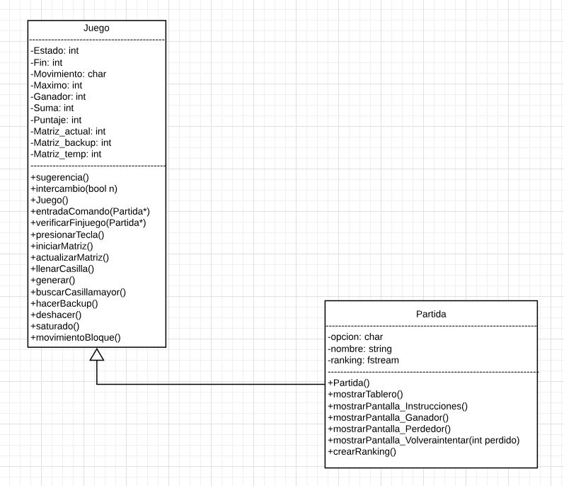
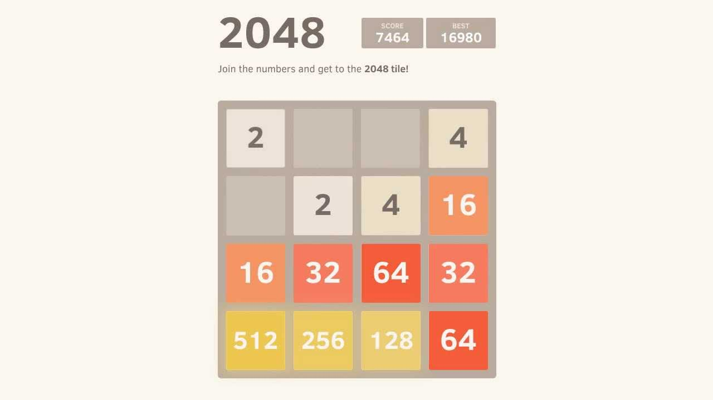

# 2048: El videojuego hecho en consola
> Proyecto POO II

## Paradigmas:
* Programacion orientada a objetos
* Programacion generica
* Tipo abstracto de datos
* Libreria estandar C++

## Diagram Architecture:

## Concepto:
2048 es un juego para web y moviles, cuyo objetivo es deslizar baldosas (Numeros) en una cuadricula (Matriz) para combinarlas y crear el numero 2048, con el que se gana el juego. Este juego solo cuenta con baldosas de numeros pares que se pueden sumar y solo lo hacen si es el mismo numero, de lo contrario, la baldosa se queda con el numero, es decir, llena. Si se llenan todas las baldosas, el juego se termina.

## Instrucciones:
A -> Mover baldosa a la izquierda
W -> Mover baldosa a la arriba
S -> Mover baldosa a la abajo
D -> Mover baldosa a la derecha
I -> Instrucciones
B -> Deshacer el movimiento anterior
Q -> Salir del juego

## Referencia:
1. https://juego2048.es/

